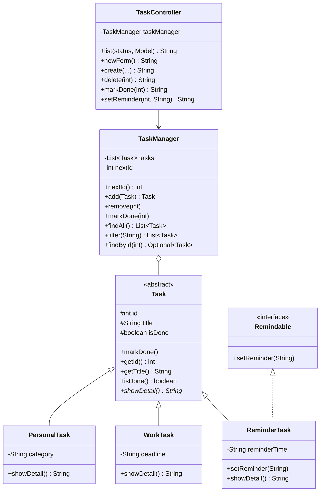

# Taskify

Simple task manager web app — final project for **Pemrograman Berorientasi Objek (PBO)**.

- **Author:** Mohamad Kholid Kamali (103042400085)
- **Stack:** Java 21, Spring Boot 4, Thymeleaf, Maven
- **Storage:** in-memory `ArrayList<Task>` (tasks reset on restart)

## Features

| # | Feature | Description |
|---|---|---|
| 1 | List tasks | Table view with id, title, detail (polymorphic), status |
| 2 | Add task | Three types: Personal (category), Work (deadline), Reminder (reminder time) |
| 3 | Delete task | Per-row Delete button |
| 4 | Mark done | Flip task to completed; row gets strikethrough, button hides |
| 5 | Filter | All / Pending / Done via `?status=` query param |
| 6 | Set reminder | Inline form only on `Remindable` rows that aren't done yet |

## Run locally

Requires Java 21+ on `PATH`. Maven is bundled via the wrapper.

```bash
./mvnw spring-boot:run
```

Then open <http://localhost:8080>. Three sample tasks are seeded on startup.

To stop: `Ctrl+C`.

## OOP coverage

The project satisfies the PBO rubric's required OOP concepts:

| Concept | Where in the code |
|---|---|
| Encapsulation | `Task` fields `protected`; `isDone` only mutated via `markDone()`; `TaskManager.findAll()` returns defensive copy |
| Inheritance | `PersonalTask`, `WorkTask`, `ReminderTask` all `extends Task` |
| Abstract class | `Task` with abstract method `showDetail()` |
| Interface | `Remindable` implemented by `ReminderTask` |
| Polymorphism | `List<Task>` holds mixed subtypes; `task.showDetail()` dispatches per concrete type; reminder endpoint guards via `instanceof Remindable` (programs to interface, not implementation) |

## Class diagram



## Project layout

```
src/main/java/com/taskify/
├── TaskifyApplication.java   ← entry point + sample-data seeder
├── domain/                   ← model layer (5 classes)
├── service/                  ← TaskManager (in-memory store + logic)
└── web/                      ← TaskController (HTTP endpoints)

src/main/resources/
├── application.properties    ← runtime config
├── templates/                ← Thymeleaf HTML (list, new)
└── static/                   ← style.css
```

## Course documents

Detailed notes (not in git, kept locally as study material):

- `artefact/task-requirement.md` — original course requirements
- `artefact/Taskify_Comprehensive_Documentation.md` — proposal with class diagram and OOP analysis
- `artefact/PLAN.md` — 11-step implementation plan
- `artefact/ARCHITECTURE.md` — file-by-file walkthrough
- `artefact/GLOSARIUM.md` — technical glossary (Maven, Spring, Thymeleaf, OOP terms)
